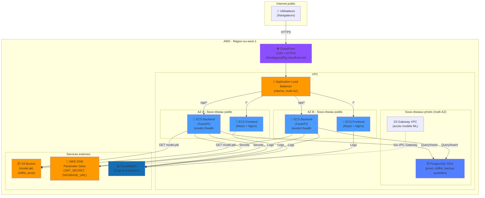

# EduScore — Évaluation du Risque de Décrochage Scolaire

**Master Intelligence Artificielle — Cloud Computing & Sécurité, 2iE**

**Groupe 1**
- BAKOUAN Y. Jean De Dieu Eben-Ezer
- KONE Zana Jean Baptiste

**Plateforme :** AWS, région `eu-west-1`
**Repository :** https://github.com/ZANA-JB/Projet_securitecloud_used
**Application déployée :** https://d3oufpgazy9f3g.cloudfront.net

---

## Sommaire

- [Présentation](#présentation)
- [Démarrage rapide](#démarrage-rapide)
- [Configuration](#configuration)
- [Authentification Google (local)](#authentification-google-local)
- [Architecture](#architecture)
- [Modèle ML](#modèle-ml)
- [Développement local](#développement-local)
- [Docker Hub](#docker-hub)
- [AWS ECR](#aws-ecr)
- [Déploiement AWS (ECS Fargate)](#déploiement-aws-ecs-fargate)
- [CI/CD — GitHub Actions](#cicd--github-actions)
- [Sécurité](#sécurité)
- [Coûts](#coûts)
- [Vérifications avant rendu](#vérifications-avant-rendu)
- [Structure du projet](#structure-du-projet)

---

## Présentation

**EduScore** est une plateforme d'aide à la décision destinée aux établissements scolaires. À partir du profil saisi par l'enseignant (niveau scolaire, filière, note moyenne, taux d'assiduité, heures d'étude par semaine, accès aux ressources et résultat du dernier examen), l'application prédit l'une des trois catégories suivantes, accompagnée d'un score de confiance :

- **En réussite**
- **À surveiller**
- **À risque de décrochage**

La prédiction est assurée par un modèle de classification multi-classe (Random Forest, scikit-learn). L'application est conteneurisée (React + FastAPI + PostgreSQL) et déployée sur AWS (ECS Fargate) derrière CloudFront et un Application Load Balancer.

---

## Démarrage rapide

```bash
git clone https://github.com/ZANA-JB/Projet_securitecloud_used.git
cd Projet_securitecloud_used
cp .env.example .env
docker compose up --build
```

Docker Compose lit automatiquement le fichier `.env` à la racine. Pour utiliser un autre fichier :

```bash
docker compose --env-file .env up --build
```

### Accès aux services

| Service | URL | Remarque |
|---|---|---|
| Application | http://localhost:5173 | Redirige vers `/login` si non connecté |
| API | http://localhost:8000 | — |
| Swagger | http://localhost:8000/docs | Documentation interactive de l'API |

Test rapide de disponibilité de l'API :

```bash
curl http://localhost:8000/health
```

### Arrêter la stack

```bash
docker compose down
```

### Réinitialiser la base locale

À faire si vous changez les identifiants PostgreSQL, ou si vous obtenez l'erreur :
`FATAL: password authentication failed for user "app"` (le volume PostgreSQL conserve le mot de passe du premier lancement).

```bash
docker compose down -v
docker compose up --build
```

### Lancer un seul service Docker

Services disponibles : `db`, `backend`, `frontend`.

```bash
docker compose up db                            # PostgreSQL seul
docker compose up --build backend               # backend + dépendances
docker compose up --build frontend              # frontend + dépendances
docker compose up --build -d backend            # en arrière-plan
docker compose up --build --no-deps frontend    # sans dépendances déjà lancées
docker compose logs -f backend
```

Après modification d'une variable `VITE_*`, relancer :

```bash
docker compose up --build frontend
```

---

## Configuration

Le fichier `.env.example` est le modèle à copier en `.env`. Le `.env` local ne se commit jamais.

| Variable | Utilisation |
|---|---|
| `POSTGRES_USER`, `POSTGRES_PASSWORD`, `POSTGRES_DB` | PostgreSQL dans Docker Compose |
| `GOOGLE_CLIENT_ID` | Backend : vérification du token Google |
| `VITE_GOOGLE_CLIENT_ID` | Frontend : bouton Google Identity Services |
| `JWT_SECRET` | Signature des JWT applicatifs |
| `ADMIN_EMAILS` | Emails autorisés dans `/admin` |
| `MODEL_S3_BUCKET`, `MODEL_S3_KEY` | Chargement du modèle depuis S3 |
| `AWS_REGION` | Région AWS, par défaut `eu-west-1` |

> Le backend exécuté sans Docker utilise SQLite par défaut. Avec Docker Compose, `DATABASE_URL` est construit automatiquement vers PostgreSQL. Ne pas ajouter `DATABASE_URL` dans `.env.example`.

---

## Authentification Google (local)

Pour activer Google Login en local :

1. Créer un client OAuth Web dans Google Cloud Console.
2. Dans *Google Auth Platform > Branding*, renseigner un nom clair (par exemple `2IE-IA-PROJECT-TEMPLATE` ou le nom du projet du groupe). Ce nom s'affiche sur l'écran Google « Sign in to continue to ... ».
3. Ajouter `http://localhost:5173` dans *Authorized JavaScript origins*.
4. Ajouter aussi `http://127.0.0.1:5173` si vous ouvrez l'application avec `127.0.0.1`.
5. Ne pas ajouter `/login` ni de slash final : Google attend uniquement l'origine.
6. Mettre le même Client ID dans `GOOGLE_CLIENT_ID` et `VITE_GOOGLE_CLIENT_ID`.
7. Ajouter votre email dans `ADMIN_EMAILS` pour obtenir l'accès administrateur.

**Erreur `Error 401: invalid_client` avec `no registered origin`** : le client OAuth utilisé par le frontend n'a pas l'origine locale autorisée. Corriger les origines dans Google Cloud Console, sauvegarder, attendre une à deux minutes, puis recharger la page.

---

## Architecture

### Architecture déployée (Livrable 2)

L'application est déployée en production sur AWS selon la **variante budget** définie dans le Livrable 1, avec l'ajout de **CloudFront** comme CDN et point de terminaison HTTPS.



Le schéma source de cette architecture est disponible dans [`infra/aws/`](infra/aws/) (`architecture_AWS.png`).

### Flux opérationnel

- Le navigateur de l'utilisateur atteint **CloudFront** (HTTPS), point d'entrée public de l'application.
- CloudFront relaie les requêtes vers l'**ALB**, réparti sur deux zones de disponibilité (AZ A / AZ B).
- L'ALB route `/api/*` vers le service **backend ECS Fargate** (FastAPI) et `/*` vers le service **frontend ECS Fargate** (React + Nginx).
- Le backend charge le modèle ML depuis **S3** au démarrage (avec cache mémoire), stocke les prédictions dans **PostgreSQL RDS**, et récupère ses secrets (`JWT_SECRET`, `DATABASE_URL`) depuis **AWS SSM Parameter Store**.
- Le bucket S3 du modèle, la base de données et SSM sont **privés** : aucun accès direct depuis Internet, uniquement via les rôles IAM des tâches ECS.
- Les logs de tous les services sont centralisés dans **CloudWatch**.

### Évolution par rapport à l'architecture prévue (Livrable 1)

| Composant | Prévu (L1) | Réalisé (L2) |
|---|---|---|
| Frontend | ECS Fargate React + Nginx | Identique |
| Backend | ECS Fargate FastAPI | Identique |
| Base de données | PostgreSQL RDS privé | Identique |
| Modèle ML | S3 privé chiffré | Identique — chargé au démarrage |
| CloudFront | Non prévu | Ajouté (CDN + HTTPS) |
| ALB / HTTPS | ALB multi-AZ + HTTPS | Certificat ACM |
| Secrets SSM | AWS SSM Parameter Store | JWT et DB URL injectés |
| Authentification | Google OAuth + JWT | Effectué |
| NAT Gateway | Optionnel (budget) | Non déployé (économie de coûts) |
| CloudWatch | Logs + métriques | Dashboards actifs |

### Services Docker Compose

| Service | Rôle | Port |
|---|---|---|
| `frontend` | React buildé puis servi par Nginx | 5173 |
| `backend` | API FastAPI + inférence ML | 8000 |
| `db` | PostgreSQL 16 (image officielle `postgres:16-alpine`) | interne |

Deux images sont construites (`frontend`, `backend`). Le service `db` utilise directement l'image officielle `postgres:16-alpine`.

---

## Modèle ML

Le formulaire EduScore envoie 8 informations, dont 7 features utilisées par le modèle :

| Feature | Type | Description / Valeurs |
|---|---|---|
| `nom_eleve` | string | Identifiant (stocké pour l'historique, non utilisé par le modèle) |
| `niveau_scolaire` | catégorie | Primaire, Collège, Lycée, Supérieur |
| `filiere` | catégorie | Mathématiques, Français, Anglais, Sciences, Histoire, Informatique |
| `note_moyenne` | float | Note moyenne sur 20 |
| `taux_assiduite` | float | Taux de présence en cours (0–100 %) |
| `heures_etude` | float | Heures d'étude par semaine |
| `acces_ressources` | int | 0 = aucun, 1 = limité, 2 = correct, 3 = très bon |
| `resultat_examen` | catégorie | Réussi, Échoué, Non passé |

Le modèle est un classifieur multi-classe **Random Forest** (scikit-learn). Les variables catégoriques sont encodées via un `OrdinalEncoder` à catégories fixes, sérialisé dans `model.pkl`. Le modèle prédit l'une des trois catégories : **En réussite**, **À surveiller** ou **À risque de décrochage**, accompagnée d'un score de confiance.

### Chargement du modèle

Le backend charge le modèle dans cet ordre :

1. **S3** si `MODEL_S3_BUCKET` est défini, ou si `MODEL_PATH` est un URI `s3://...`.
2. **Fichier local** si `MODEL_PATH` existe.
3. **Fallback** EduScore entraîné automatiquement.

### Entraînement et publication sur S3

Flux à retenir :

1. Entraîner le modèle.
2. Créer un bucket S3 privé.
3. Uploader `model.pkl` dans ce bucket.
4. Configurer `MODEL_S3_BUCKET` et `MODEL_S3_KEY`.
5. Lancer le backend ou la tâche ECS.

Générer un modèle local d'exemple :

```bash
cd backend
uv run python ../scripts/train.py
cd ..
```

Cela crée :

```text
backend/models/model.pkl
```

Créer le bucket S3 privé et uploader le modèle :

```bash
aws s3 mb s3://2ie-bakouan01-models --region eu-west-1
aws s3 cp backend/models/model.pkl s3://2ie-bakouan01-models/model.pkl
```

Ou utiliser le script du template, qui crée le bucket privé si nécessaire et active **Block Public Access** :

```bash
MODEL_S3_BUCKET=2ie-<groupe>-models AWS_REGION=eu-west-1 bash scripts/setup-s3-model.sh
```

Puis configurer :

```bash
MODEL_S3_BUCKET=2ie-<groupe>-models
MODEL_S3_KEY=model.pkl
AWS_REGION=eu-west-1
```

> `scripts/build-images.sh`, `scripts/push-dockerhub.sh` et `scripts/push-ecr.sh` construisent et poussent uniquement les images Docker. Ils **ne créent pas** le bucket S3 du modèle. Le bucket S3 doit être préparé avant ECS avec les commandes ci-dessus ou avec `scripts/setup-s3-model.sh`.

---

## Développement local

### Backend (depuis `backend/`)

```bash
uv sync
uv run ruff check .
uv run pytest -q
uv run uvicorn app.main:app --reload
```

Endpoints exposés par l'API :

| Endpoint | Méthode | Description |
|---|---|---|
| `/health` | GET | Retourne `{"status": "ok"}`, utilisé par les health checks de l'ALB |
| `/predict` | POST | Reçoit un objet JSON validé via Pydantic v2, interroge le modèle ML et renvoie la catégorie prédite avec le score de confiance |
| `/history` | GET | Retourne l'historique des prédictions depuis PostgreSQL |

### Frontend (depuis `frontend/`)

```bash
npm install
npm run build
npm run dev
```

L'application React 18 (servie par Nginx en production) propose un formulaire de saisie complet :

- **Nom de l'élève** : champ texte libre.
- **Niveau scolaire** : menu déroulant (Primaire / Collège / Lycée / Supérieur).
- **Filière / matière principale** : menu déroulant (Mathématiques, Français, Anglais, Sciences, Histoire, Informatique).
- **Note moyenne** : champ numérique sur 20.
- **Taux d'assiduité** : curseur 0–100 %.
- **Heures d'étude par semaine** : champ numérique.
- **Accès aux ressources** : sélecteur 0 (aucun) à 3 (très bon).
- **Résultat dernier examen** : boutons radio (Réussi / Échoué / Non passé).

### Base de données — PostgreSQL

La base de données **PostgreSQL 15** (instance RDS `db.t3.micro` en production) stocke :

- **`users`** : comptes utilisateurs (authentification Google OAuth).
- **`predictions`** : historique complet des évaluations (données d'entrée, résultat, score de confiance, horodatage).
- **`items`** : éléments de référence liés à une prédiction (libellé, valeur, date de création).

L'accès est géré via **SQLAlchemy** (ORM, pas de SQL brut). En local sans Docker, le backend utilise SQLite par défaut ; avec Docker Compose, `DATABASE_URL` pointe automatiquement vers PostgreSQL. En production, `DATABASE_URL` est injectée depuis AWS SSM Parameter Store.

---

## Docker Hub

### Build local

```bash
docker build -t <dockerhub-user>/projet-cloud-backend:latest backend
docker build -t <dockerhub-user>/projet-cloud-frontend:latest frontend
```

### Version scriptée

```bash
DOCKERHUB_USERNAME=<dockerhub-user> bash scripts/push-dockerhub.sh
```

> Si `DOCKERHUB_TOKEN` est défini dans `.env`, il doit avoir le droit **Read & Write**. Un token en lecture seule provoque l'erreur : `access token has insufficient scopes`.

### Push

```bash
docker login
docker push <dockerhub-user>/projet-cloud-backend:latest
docker push <dockerhub-user>/projet-cloud-frontend:latest
```

### Pull (récupérer une image déjà publiée, sans la rebuilder)

```bash
docker pull <dockerhub-user>/projet-cloud-backend:latest
docker pull <dockerhub-user>/projet-cloud-frontend:latest
```

### Secrets et variables CI

Pour la CI GitHub, configurer dans *Settings > Secrets and variables > Actions* :

| Secret | Valeur |
|---|---|
| `DOCKERHUB_USERNAME` | Login Docker Hub |
| `DOCKERHUB_TOKEN` | Token Docker Hub avec droit Read & Write |

| Variable | Valeur |
|---|---|
| `VITE_GOOGLE_CLIENT_ID` | Client ID public Google pour l'image frontend |
| `AWS_REGION` | Région AWS, par exemple `eu-west-1` |

---

## AWS ECR

### Créer les repositories

```bash
aws ecr create-repository --repository-name projet-cloud-backend --region eu-west-1
aws ecr create-repository --repository-name projet-cloud-frontend --region eu-west-1
```

### Login et push

```bash
AWS_ACCOUNT_ID=<votre-account-id>
AWS_REGION=eu-west-1

aws ecr get-login-password --region $AWS_REGION \
  | docker login --username AWS --password-stdin $AWS_ACCOUNT_ID.dkr.ecr.$AWS_REGION.amazonaws.com

docker tag <dockerhub-user>/projet-cloud-backend:latest \
  $AWS_ACCOUNT_ID.dkr.ecr.$AWS_REGION.amazonaws.com/projet-cloud-backend:latest
docker tag <dockerhub-user>/projet-cloud-frontend:latest \
  $AWS_ACCOUNT_ID.dkr.ecr.$AWS_REGION.amazonaws.com/projet-cloud-frontend:latest

docker push $AWS_ACCOUNT_ID.dkr.ecr.$AWS_REGION.amazonaws.com/projet-cloud-backend:latest
docker push $AWS_ACCOUNT_ID.dkr.ecr.$AWS_REGION.amazonaws.com/projet-cloud-frontend:latest
```

### Pull (vérification manuelle)

```bash
docker pull $AWS_ACCOUNT_ID.dkr.ecr.$AWS_REGION.amazonaws.com/projet-cloud-backend:latest
docker pull $AWS_ACCOUNT_ID.dkr.ecr.$AWS_REGION.amazonaws.com/projet-cloud-frontend:latest
```

> En production, ce `pull` est effectué automatiquement par ECS au lancement des tâches. La commande ci-dessus sert uniquement à vérifier manuellement qu'une image poussée est bien récupérable.

### Version scriptée

Crée les repositories si besoin :

```bash
AWS_ACCOUNT_ID=<votre-account-id> AWS_REGION=eu-west-1 bash scripts/push-ecr.sh
```

### CI/CD — push ECR

Pour activer le push ECR en CI, créer un rôle IAM OIDC pour GitHub Actions et ajouter le secret GitHub :

| Secret | Valeur |
|---|---|
| `AWS_ROLE_TO_ASSUME` | ARN du rôle IAM assumé par GitHub Actions |

---

## Déploiement AWS (ECS Fargate)

### Infrastructure

- VPC avec sous-réseaux publics et privés, répartis sur deux zones de disponibilité.
- Rôle `ecsTaskExecutionRole` pour ECR + CloudWatch Logs.
- Rôle applicatif avec lecture seule sur `s3://2ie-bakouan01-models/model.pkl`.
- Security Groups : `ALB-SG`, `BACKEND-SG`, `DB-SG`.
- RDS PostgreSQL dans un sous-réseau privé (multi-AZ pour les backups).
- ALB public, réparti sur AZ A et AZ B, vers les services ECS frontend et backend.
- CloudFront en point d'entrée HTTPS de l'application.

### Application déployée

L'application est accessible publiquement à l'adresse :

**https://d3oufpgazy9f3g.cloudfront.net**

Les services ECS `eduscore-backend-alb-service` et `eduscore-frontend-alb-service` sont actifs dans le cluster `Projet_cloud` (statut `RUNNING`, console AWS ECS).

### Rôles IAM (synthèse)

| Rôle | Pour qui | Permissions | Principe |
|---|---|---|---|
| Administrateur | Coordinateur | Accès complet AWS (ECS, ECR, RDS, S3, SSM, CloudWatch, budget) | MFA obligatoire, audit des accès |
| Développeur | Membres du groupe | ECS (déploiement), ECR (push), S3 (lecture modèles), CloudWatch (logs), SSM (consultation) | Pas de droits IAM ni de suppression, clés temporaires |
| CI/CD (GitHub Actions) | Pipeline d'automatisation | Assume un rôle AWS OIDC, push ECR, déploiement ECS | Identité fédérée OIDC, aucune clé d'accès stockée |
| Rôle d'exécution ECS | Services backend/frontend | Pull image ECR, écriture logs CloudWatch, accès SSM | Rôle technique standard, moindre privilège |
| Rôle applicatif backend | Code FastAPI | `s3:GetObject` sur le bucket modèle, `rds-db:connect`, `ssm:GetParameter` | Moindre privilège strict : pas de `ListBucket`, pas de suppression |
| Utilisateurs métier (frontend) | Enseignants, conseillers | Authentification Google SSO | Contrôle au niveau application, pas AWS |

---

## CI/CD — GitHub Actions

Le workflow `.github/workflows/ci-cd.yml` s'exécute à chaque push sur `main` :

1. **Scan secrets** avec Trufflehog — bloque si un secret est détecté.
2. **Audit des dépendances** avec `pip-audit` — bloque si une CVE critique est trouvée.
3. **Tests unitaires** avec `pytest`.
4. **Build des images Docker** (backend + frontend).
5. **Push vers ECR**.
6. **Déploiement ECS Fargate**.

Le scan Trufflehog en CI n'a détecté que des résultats *unverified*, non confirmés comme des secrets valides après analyse. Les éléments identifiés ont néanmoins été corrigés et déplacés vers des variables d'environnement, avec des patterns d'exclusion ajoutés dans `.trufflehog.yml` pour éviter les faux positifs liés aux clés d'exemple de `.env.example`.

---

## Sécurité

### Synthèse des risques (Livrable 1)

| Risque | Impact | Probabilité | Mesure prévue |
|---|---|---|---|
| Fuite de secrets (clés API, `JWT_SECRET`) dans Git | Élevé | Moyenne | `.gitignore` + `.env.example` ; scan Trufflehog en CI ; secrets en variables d'environnement |
| Données d'élèves exposées (S3/RDS public) | Élevé | Moyenne | Block Public Access S3 ; RDS en sous-réseau privé ; chiffrement S3/RDS ; accès via VPC Gateway |
| Accès non autorisé à l'API de prédiction | Élevé | Moyenne | Google OAuth + JWT ; CORS restreint ; rate-limit 20 req/min/IP sur `/predict` |
| Vol du modèle par requêtes massives | Moyen | Moyenne | Rate-limit strict ; authentification requise ; logs CloudWatch |
| Injection SQL (prédictions/historique) | Élevé | Faible | ORM SQLAlchemy ; validation Pydantic v2 ; pas de SQL brut |
| Image Docker vulnérable en production | Moyen | Moyen | Scan Trivy en CI |
| Dérive des coûts AWS | Moyen | Moyen | Pas de NAT Gateway ; monitoring ECS |
| Indisponibilité sur panne d'une zone | Moyen | Faible | Déploiement multi-AZ ; ALB en failover automatique |
| Non-conformité RGPD | Élevé | Moyen | Audit des accès ; suppression à la demande ; consentement documenté |
| Attaque DDoS sur le frontend public | Moyen | Faible | ALB + WAF AWS (optionnel) ; rate-limiting applicatif |

**Risque prioritaire** : la confidentialité des données scolaires. Les dossiers d'élèves contiennent des données sensibles (résultats). La conformité RGPD et les directives éducatives imposent de maintenir S3 et RDS strictement privés.

### État de mise en œuvre (Livrable 2)

14 des 16 mesures de sécurité planifiées dans le Livrable 1 ont été mises en œuvre.

| Mesure prévue (L1) | Réalisée ? | Preuve / Écart |
|---|---|---|
| Secrets en variables d'environnement (GitHub Secrets) | Oui | GitHub Secrets configurés |
| `.gitignore` + `.env.example` sans valeurs | Oui | Présent dans le repo |
| Scan Trufflehog en CI | Oui | Step CI actif |
| Audit dépendances `pip-audit` | Oui | Step CI actif |
| Scan image Trivy en CI | Oui | Step CI actif |
| HTTPS en production (CloudFront + ACM) | Oui | Certificat ACM, application accessible en HTTPS |
| Validation Pydantic v2 sur `/predict` | Oui | Schéma `Prediction` |
| ORM SQLAlchemy (pas de SQL brut) | Oui | Pas d'injection SQL |
| S3 Block Public Access activé | Oui | Console AWS |
| RDS sous-réseau privé + chiffrement | Oui | Configuration VPC |
| SSM Parameter Store pour les secrets | Oui | Injecté dans les tâches ECS |
| IAM moindre privilège par rôle | Oui | Rôles ECS configurés |
| Rate-limit 20 req/min/IP sur `/predict` | Oui | SlowAPI configuré |
| Google OAuth + JWT | Oui | Authentification Google + JWT applicatif |
| WAF AWS | Non | Hors budget |
| Multi-AZ RDS (failover actif) | Partiel | Backup activé, failover non configuré |

### Gestion des secrets

- **Secrets CI/CD** (GitHub Secrets) : `AWS_ROLE_ARN`, `ECR_REGISTRY`, `AWS_REGION`, `DOCKERHUB_USERNAME`, `DOCKERHUB_TOKEN`.
- **Secrets applicatifs** (AWS SSM Parameter Store) : `JWT_SECRET`, `DATABASE_URL` — injectés dans les conteneurs ECS via rôle IAM.
- Aucun secret en clair dans le dépôt Git ; `.env.example` ne contient aucune valeur réelle.

---

## Coûts

### Estimation initiale (Livrable 1)

| Poste | Service | Détails | Coût/mois estimé |
|---|---|---|---|
| Compute Backend | ECS Fargate | 2 tâches (0,5 vCPU, 1 GB RAM) en continu | ~15 $ |
| Compute Frontend | ECS Fargate | 2 tâches (0,25 vCPU, 512 MB RAM) en continu | ~8 $ |
| Répartiteur | Application Load Balancer | 1 ALB, ~200 req/s pic | ~18 $ |
| Base de données | PostgreSQL RDS | `db.t3.micro`, 20 GB SSD, backup automatique | ~12 $ |
| Stockage modèle | S3 (model.pkl + logs) | ~500 MB, 6 000 GET/mois | ~0,50 $ |
| Secrets & config | SSM Parameter Store | ~10 paramètres | ~0 $ (free tier) |
| Monitoring & logs | CloudWatch | ~50 GB/mois logs, métriques | ~5 $ |
| Transfert de données | Data Transfer | VPC Gateway (gratuit), Internet sortant | ~2 $ |
| Autres | ECR, Security Groups | Stockage images + gestion | ~1 $ |
| **Total estimé** | Architecture budget | | **~61,50 $** |

### Coûts réels vs estimés (Livrable 2)

| Poste | Service | Estimé (L1) | Réel (L2) |
|---|---|---|---|
| Compute Backend | ECS Fargate (2 tâches) | 15,00 $ | ≈ 2-3 $ |
| Compute Frontend | ECS Fargate (2 tâches) | 8,00 $ | ≈ 1-2 $ |
| Load Balancer | ALB | 18,00 $ | ≈ 2-3 $ |
| CDN | CloudFront | 0,00 $ | ≈ 1,50 $ |
| Base de données | PostgreSQL RDS t3.micro | 12,00 $ | ≈ 2-3 $ |
| Stockage modèle | S3 (~500 MB) | 0,50 $ | ≈ 0,50 $ |
| Secrets | SSM Parameter Store | 0,00 $ | 0,00 $ |
| Monitoring | CloudWatch | 5,00 $ | ≈ < 1 $ |
| Transfert | Data Transfer | 2,00 $ | ≈ 1,50 $ |
| Divers | ECR, Security Groups | 1,00 $ | ≈ 1,00 $ |
| **Total** | | **61,50 $** | **≈ 9,52 $** |

Le coût réel est inférieur de **84,5 %** à l'estimation initiale, grâce à l'absence de NAT Gateway et à l'optimisation des tâches ECS.

### Pistes d'économies supplémentaires

- **ECS Spot** : réduction d'environ 70 % sur le compute, acceptable pour une plateforme éducative sans SLA critique.
- **S3 Intelligent-Tiering** : archivage automatique des logs.

---

## Difficultés rencontrées et solutions

| Difficulté | Cause | Solution apportée |
|---|---|---|
| Health check ALB en échec | Le backend met ~30 s à charger le modèle depuis S3 | `healthCheckGracePeriodSeconds=60` dans la définition de tâche ECS |
| Connexion RDS refusée | Security Group RDS trop restrictif | Règle ingress depuis le Security Group du backend |
| Trufflehog — faux positifs | Clés d'exemple dans `.env.example` | Patterns d'exclusion dans `.trufflehog.yml` |
| Timeout sur `/predict` | Modèle rechargé à chaque requête | Cache mémoire au démarrage (`startup` event) |
| Encodage catégoriel | Niveaux/filières non reconnus en production | `OrdinalEncoder` à catégories fixes, sérialisé dans `model.pkl` |
| CORS bloqué côté React | Domaine CloudFront absent de la whitelist | `CORSMiddleware` mis à jour avec le domaine CloudFront |

---

## Vérifications avant rendu

```bash
cd backend
uv run ruff check .
uv run pytest -q

cd ../frontend
npm run build

cd ..
docker compose up --build
```

Checklist :

- `http://localhost:5173` redirige vers `/login` si aucun utilisateur n'est connecté.
- Une évaluation scolaire retourne un score.
- `/login` affiche le bouton Google.
- Un administrateur connecté voit les statistiques et l'historique.
- Aucun secret n'est commité.

---

## Structure du projet

```
.
├── backend/                  API FastAPI (app, models, tests, Dockerfile)
├── frontend/                 React + Vite, servi par Nginx
├── infra/aws/                Schémas d'architecture AWS
├── scripts/
│   ├── train.py               entraînement du modèle EduScore
│   ├── setup-s3-model.sh       création du bucket S3 modèle (Block Public Access)
│   ├── build-images.sh         build des images Docker
│   ├── push-dockerhub.sh       push vers Docker Hub
│   └── push-ecr.sh             création des repositories ECR et push
├── docker-compose.yml
├── .env.example
└── .github/workflows/ci-cd.yml
```

---

## Conclusion

Le projet EduScore concrétise sur AWS le plan défini dans le Livrable 1 : l'application est déployée, accessible en HTTPS via https://d3oufpgazy9f3g.cloudfront.net, et produit des prédictions de décrochage scolaire en temps réel à partir du profil complet de l'élève.

- **Architecture** : variante budget respectée, avec CloudFront ajouté pour la performance et la sécurité.
- **Modèle ML** : 7 features couvrant le profil scolaire complet, 3 catégories de sortie avec score de confiance.
- **Sécurité** : 14 des 16 mesures planifiées implémentées.
- **CI/CD** : Trufflehog et pip-audit actifs sur chaque push.
- **Coûts** : ~9,52 $/mois, soit 84,5 % inférieur à l'estimation initiale.

**Perspectives** : intégration d'un WAF AWS, mise en place de tests end-to-end en CI, configuration du failover Multi-AZ pour RDS.

---

*Projet pédagogique — Master Intelligence Artificielle, 2iE.*