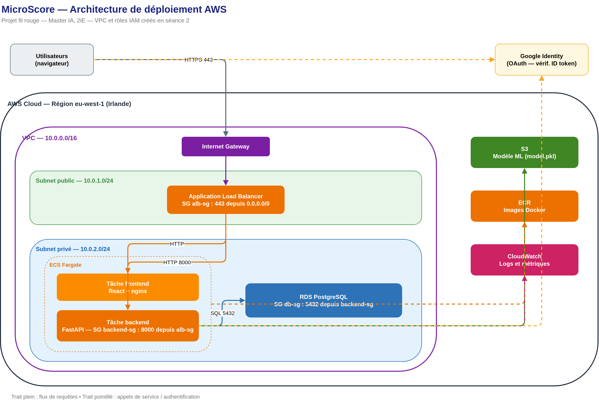
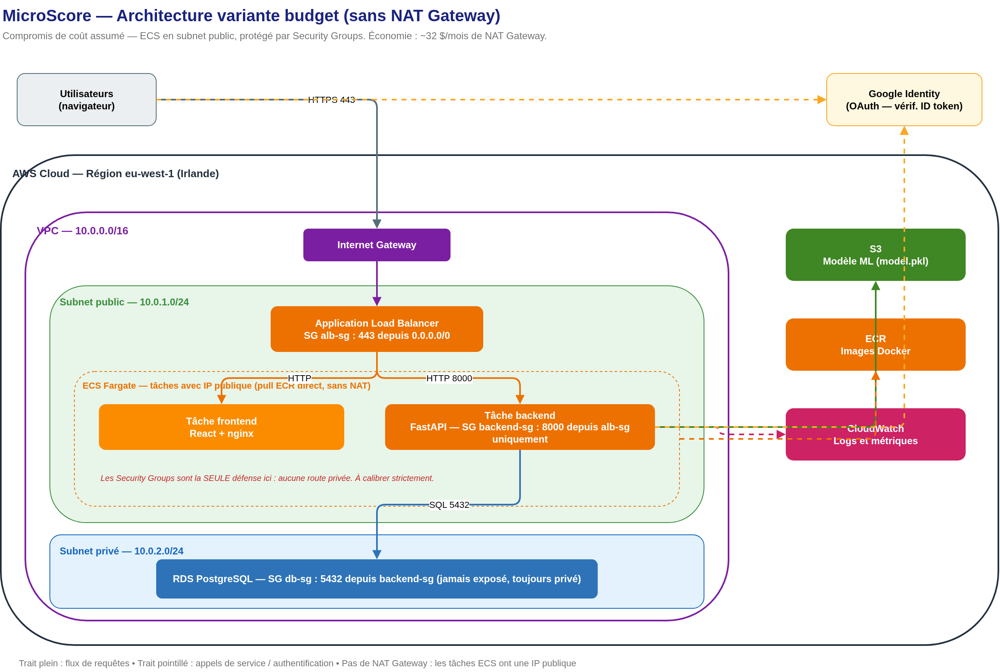

# Architecture AWS — deux variantes

Ce dossier décrit l'architecture de déploiement de MicroScore. Deux variantes,
selon que l'on optimise la sécurité ou le coût.

Les sources éditables sont les fichiers `.drawio` (ouvrables sur
app.diagrams.net) ; les images ci-dessous en sont le rendu.

---

## Variante référence

Tâches ECS (frontend + backend) dans le **subnet privé**.

- Sécurité maximale : les conteneurs ne sont pas routables depuis Internet,
  même si un Security Group était mal configuré.
- **Mais** : une tâche Fargate en subnet privé doit télécharger son image
  depuis ECR. Sans route Internet, il faut un **NAT Gateway**.
- Coût du NAT Gateway : **~32 $/mois**, fixe, facturé même au repos.

C'est l'architecture que toute entreprise sérieuse déploierait. C'est celle
à présenter comme cible dans le Livrable 1.

---

## Variante budget — celle qu'on déploie en TP

Tâches ECS (frontend + backend) dans le **subnet public**, avec IP publique.

- La tâche tire son image ECR directement via l'Internet Gateway : **0 $ de NAT**.
- La protection repose **entièrement sur les Security Groups** : `backend-sg`
  n'autorise le port 8000 que depuis `alb-sg`. Le conteneur a beau être
  routable, tout trafic non autorisé est jeté.
- Une seule couche de défense au lieu de deux. Acceptable pour un projet
  pédagogique, **à ne pas faire pour une vraie application bancaire**.

C'est ce qu'on déploie réellement en TP, faute de budget pour un NAT Gateway.

---

## Le point commun aux deux

- L'**ALB** est dans le subnet **public** — c'est la porte d'entrée HTTPS.
- **RDS PostgreSQL** est dans le subnet **privé** — une base de données n'est
  jamais joignable depuis Internet, dans aucune des deux variantes.
- Les **Security Groups** en cascade : `alb-sg` (443 depuis tout) →
  `backend-sg` (8000 depuis `alb-sg`) → `db-sg` (5432 depuis `backend-sg`).
- Services hors VPC : **ECR** (images), **S3** (modèle ML), **CloudWatch** (logs).

## Le piège à éviter

Mettre **le frontend en public et le backend en privé** est le pire choix :
on paie quand même le NAT Gateway (à cause du backend privé) ET on a une
tâche exposée. Les deux variantes ci-dessus sont cohérentes ; ce mélange ne
l'est pas.

## Rappel conceptuel

« Subnet public » ne veut pas dire « contenu public ». Le contenu du frontend
est public (tout le monde voit l'app React), mais ça ne détermine pas son
subnet. Le subnet répond à une seule question : *cette ressource a-t-elle une
route directe vers l'Internet Gateway ?* Le frontend, derrière l'ALB, n'en a
pas besoin — sauf pour la raison de coût expliquée plus haut.

## Comparatif

| Critère | Référence | Budget |
|---|---|---|
| Tâches ECS | Subnet privé | Subnet public + IP publique |
| NAT Gateway | Oui | Non |
| Coût mensuel NAT | ~32 $ | 0 $ |
| Couches de défense réseau | 2 (routage + SG) | 1 (SG uniquement) |
| RDS | Subnet privé | Subnet privé |
| Recommandé pour | Production réelle | Projet pédagogique |

L'écart entre les deux est exactement le genre de chose à documenter dans la
section « écarts plan / réalité » du Livrable 2.

## Fichiers du dossier

| Fichier | Rôle |
|---|---|
| `architecture.drawio` / `architecture.png` | Variante référence — source + rendu |
| `architecture-budget.drawio` / `architecture-budget.png` | Variante budget — source + rendu |
| `task-definition-backend.example.json` | Exemple de task definition ECS backend |
| `task-definition-frontend.example.json` | Exemple de task definition ECS frontend |
| `s3-model-read-policy.example.json` | Policy IAM de lecture du modèle sur S3 |
